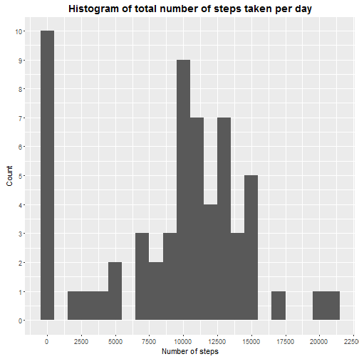
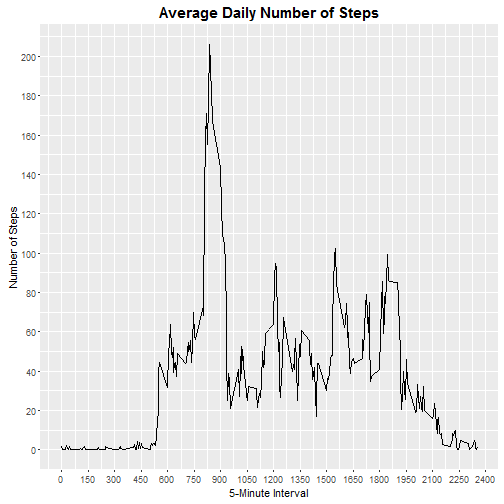
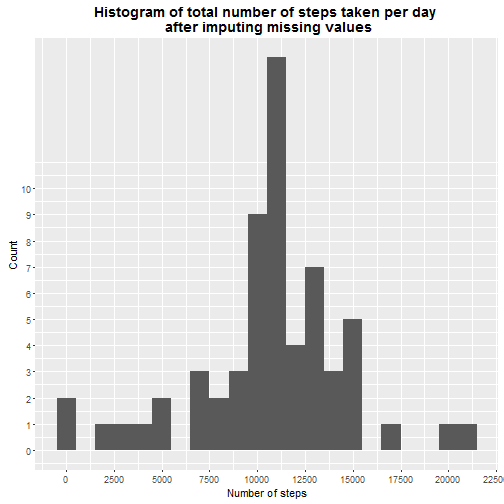
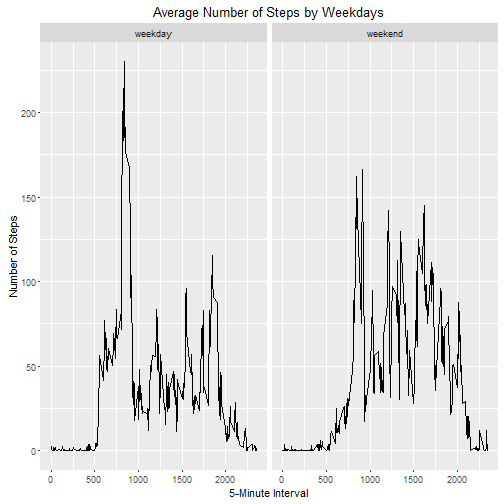

# Introduction 

It is now possible to collect a large amount of data about personal movement using activity monitoring devices such as a [Fitbit](http://www.fitbit.com/eu), [Nike Fuelband](http://www.nike.com/us/en_us/c/nikeplus-fuelband), or [Jawbone Up](https://jawbone.com/up). These type of devices are part of the "quantified self" movement -- a group of enthusiasts who take measurements about themselves regularly to improve their health, to find patterns in their behavior, or because they are tech geeks. But these data remain under-utilized both because the raw data are hard to obtain and there is a lack of statistical methods and software for processing and interpreting the data.

This assignment makes use of data from a personal activity monitoring device. This device collects data at 5 minute intervals through out the day. The data consists of two months of data from an anonymous individual collected during the months of October and November, 2012 and include the number of steps taken in 5 minute intervals each day.

# Overview of the data set

The data for this assignment can be downloaded from the course web site:

 - **Dataset**: [Activity monitoring data](https://d396qusza40orc.cloudfront.net/repdata%2Fdata%2Factivity.zip)

The variables included in this dataset are:

 - **steps**: Number of steps taking in a 5-minute interval (missing values are coded as NA)

 - **date**: The date on which the measurement was taken in YYYY-MM-DD format

 - **interval**: Identifier for the 5-minute interval in which measurement was taken

The dataset is stored in a comma-separated-value (CSV) file and there are a total of 17,568 observations in this dataset.

# Loading the data

First we set the working directory:


```r
setwd("D:/Coursera_Reproducible_Research/Project_Assignment_1")
```

Then we download the archive and we unzip it:


```r
if(!file.exists("./Activity_Data.zip")){
  
    fileUrl <- "https://d396qusza40orc.cloudfront.net/repdata%2Fdata%2Factivity.zip"  
    
    download.file(fileUrl, destfile = "./Activity_Data.zip")
    
}

unzip(zipfile = "./Activity_Data.zip", exdir = ".")
```

Finally we read the data into the "activity" data frame:


```r
activity <- read.csv(file = "./activity.csv", header = TRUE)
```

# Structure of the dataset

For this part of the project we ignore the missing values in the dataset. 

We start with taking a look at the structure of the "activity" data frame:


```r
str(activity)
```

```
## 'data.frame':	17568 obs. of  3 variables:
##  $ steps   : int  NA NA NA NA NA NA NA NA NA NA ...
##  $ date    : Factor w/ 61 levels "2012-10-01","2012-10-02",..: 1 1 1 1 1 1 1 1 1 1 ...
##  $ interval: int  0 5 10 15 20 25 30 35 40 45 ...
```

We see that the variables "steps" and "interval" are of type integer and "date" is a factor variable with 61 levels. Each level of the variable "date" represents a day between 1 October 2012 and 30 November 2012:


```r
levels(activity$date)
```

```
##  [1] "2012-10-01" "2012-10-02" "2012-10-03" "2012-10-04" "2012-10-05"
##  [6] "2012-10-06" "2012-10-07" "2012-10-08" "2012-10-09" "2012-10-10"
## [11] "2012-10-11" "2012-10-12" "2012-10-13" "2012-10-14" "2012-10-15"
## [16] "2012-10-16" "2012-10-17" "2012-10-18" "2012-10-19" "2012-10-20"
## [21] "2012-10-21" "2012-10-22" "2012-10-23" "2012-10-24" "2012-10-25"
## [26] "2012-10-26" "2012-10-27" "2012-10-28" "2012-10-29" "2012-10-30"
## [31] "2012-10-31" "2012-11-01" "2012-11-02" "2012-11-03" "2012-11-04"
## [36] "2012-11-05" "2012-11-06" "2012-11-07" "2012-11-08" "2012-11-09"
## [41] "2012-11-10" "2012-11-11" "2012-11-12" "2012-11-13" "2012-11-14"
## [46] "2012-11-15" "2012-11-16" "2012-11-17" "2012-11-18" "2012-11-19"
## [51] "2012-11-20" "2012-11-21" "2012-11-22" "2012-11-23" "2012-11-24"
## [56] "2012-11-25" "2012-11-26" "2012-11-27" "2012-11-28" "2012-11-29"
## [61] "2012-11-30"
```

Finally, we provide a summary statistic of the data:


```r
summary(activity)
```

```
##      steps                date          interval     
##  Min.   :  0.00   2012-10-01:  288   Min.   :   0.0  
##  1st Qu.:  0.00   2012-10-02:  288   1st Qu.: 588.8  
##  Median :  0.00   2012-10-03:  288   Median :1177.5  
##  Mean   : 37.38   2012-10-04:  288   Mean   :1177.5  
##  3rd Qu.: 12.00   2012-10-05:  288   3rd Qu.:1766.2  
##  Max.   :806.00   2012-10-06:  288   Max.   :2355.0  
##  NA's   :2304     (Other)   :15840
```

From the summary of the data we see that the mean number of steps for all days and time intervals is 37. Also there are 288 5-minute time intervals for each day.

# Mean total number of steps taken per day

Next, we calculate the total number of steps taken per day. In the character vector "unique.dates" we store the levels (the days on which the measurements were taken) of the factor variable "date". With the help of the R function "sapplly()" we create the integer vector "total.steps" which contains the total number of steps taken each day:


```r
unique.dates <- levels(activity$date)

total.steps <- sapply(unique.dates, function(day){

    sum(subset(activity, date == day)$steps, na.rm = TRUE)
})
```

Below we check if we correctly computed the vector "total.steps", i.e., we compare the sum of the elements of the vector "total.steps" to the sum of all steps in the "activity" data frame:


```r
sum(total.steps) == sum(activity$steps, na.rm = TRUE)
```

```
## [1] TRUE
```

It turns out that, indeed, our calculations are correct. 

## Histogram of the total number of steps taken each day

Next we make a histogram of the total number of steps taken each day. We use the "ggplot2" plotting system. 


```r
library(ggplot2)

ggplot(data = data.frame(steps = total.steps), aes(x = steps)) +
         geom_histogram(binwidth = 1000) +
         scale_x_continuous(breaks = seq(0, 25000, 2500)) +
         scale_y_continuous(breaks = seq(0, 10, 1)) +
         labs(x = "Number of steps",
              y = "Count") +
         ggtitle("Histogram of total number of steps taken per day") +
         theme(plot.title = element_text(size = 14, face = "bold"))
```



##  Mean and median of the total number of steps taken per day

The mean and median total number of steps taken per day are given below:


```r
mean(total.steps, na.rm = TRUE)
```

```
## [1] 9354.23
```

```r
median(total.steps, na.rm = TRUE)
```

```
## [1] 10395
```

# Average daily activity pattern

Nxet we make a time series plot of the 5-minute interval (x-axis) and the average number of steps taken, averaged across all days (y-axis). We use the "aggregate()" function (from the R "stats" package) to generate a data frame called "avg.steps" which contains all 288 5-minute time intervals and the corresponding mean number of steps taken, averaged across all days. 


```r
avg.steps <- aggregate(steps ~ interval, data = activity, 
                       FUN = "mean", na.action = na.omit)


ggplot(data = avg.steps, aes(x = interval, y = steps)) +
         geom_line() +
         scale_x_continuous(breaks = seq(0, 2500, 150)) +
         scale_y_continuous(breaks = seq(0, 200, 20)) +
         labs(x = "5-Minute Interval",
              y = "Number of Steps") +
         ggtitle("Average Daily Number of Steps") +
         theme(plot.title = element_text(size = 15, face = "bold"))
```



The next question we are going to answer is: "Which 5-minute interval, on average across all the days in the dataset, contains the maximum number of steps?". As we see from the code below, the 5-minute interval, which contains the maximum number of steps is the 835-th interval. 


```r
avg.steps$interval[which(avg.steps$steps == max(avg.steps$steps))]
```

```
## [1] 835
```

# Imputing missing values

We notice that there are a number observations with missing values (coded as NA). Below we calculate the number and perecentage of missing values:


```r
missing.values <- is.na(activity$steps)

sum(missing.values)
```

```
## [1] 2304
```

```r
(sum(missing.values)/dim(activity)[1])*100
```

```
## [1] 13.11475
```

There are 2304 missing values, which account for 13.1% of all observations in the "activity" data frame. The presence of missing data may lead to bias in some calculations or summaries of the data. Therefore we are going to fill in all of the missing values in the dataset with suitable data. First we write the function "detect_NA_days()" which extracts the indices of the days (we have 61 unique days of measurements) with no available data on the number of steps, as well as the indices of the days with partially missing data on the number of steps. The function returns a list of two integer vectors. 


```r
detect_NA_days <- function(mydata){
    
    days.na = vector(mode = "integer")
    
    na.partial.days = vector(mode = "integer")
    
    unique.dates <- levels(mydata$date)

    for(i in 1:length(unique.dates)){
    
        single.day <- subset(mydata, date == unique.dates[i])$steps
  
        nobs <- length(single.day)
  
        missing.values <- is.na(single.day)

        if(sum(missing.values) == nobs){
      
            days.na <- c(days.na, i)
      
        }else if(sum(missing.values) > 0) {
      
            na.partial.days <- c(na.partial.days, i) 
        }
    }
    
    return(list(days.na, na.partial.days))
}
```

Next, we apply the function to the "activity" data frame and we see that there are 8 days with entirely missing measurements of the number of steps and there are no days with partially missing data:


```r
l <- detect_NA_days(activity)
na.days <- l[[1]]
partial.na.days <- l[[2]]

na.days
```

```
## [1]  1  8 32 35 40 41 45 61
```

```r
partial.na.days 
```

```
## integer(0)
```

We also list the days with missing values:


```r
unique.dates[na.days]
```

```
## [1] "2012-10-01" "2012-10-08" "2012-11-01" "2012-11-04" "2012-11-09"
## [6] "2012-11-10" "2012-11-14" "2012-11-30"
```

Below we create a new data frame, called "activity.impute", which is equal to the original dataset but with the missing data filled in. We fill in the missing values with the average number of steps taken for each 5-minute time interval across all days:


```r
activity.impute <- activity

for(i in 1:length(na.days)){
    
 activity.impute[activity.impute$date == unique.dates[na.days[i]], "steps"] <- avg.steps[ ,"steps"]
 
}
```

Next, for the new dataset we compute the total number of steps taken per day and its mean and median:


```r
total.steps.imp <- sapply(unique.dates, function(day){
    
    sum(subset(activity.impute, date == day)$steps) 
    
})

mean(total.steps.imp)
```

```
## [1] 10766.19
```

```r
median(total.steps.imp)
```

```
## [1] 10766.19
```

and we compare them to the respective mean and median for the original "activity" data frame:


```r
mean(total.steps)
```

```
## [1] 9354.23
```

```r
median(total.steps)
```

```
## [1] 10395
```

As we can see, the two means and medians differ but they are very close numbers. Both the mean and the median of the imputed dataset are bigger than these of the original dataset. We also make a histogram of the total number of steps taken each day for the "activity.impute" dataset:


```r
ggplot(data = data.frame(steps = total.steps.imp), aes(x = steps)) +
         geom_histogram(binwidth = 1000) +
         scale_x_continuous(breaks = seq(0, 25000, 2500)) +
         scale_y_continuous(breaks = seq(0, 10, 1)) +
         labs(x = "Number of steps",
              y = "Count") +
         ggtitle("Histogram of total number of steps taken per day \n after imputing missing values") +
         theme(plot.title = element_text(size = 14, face = "bold"))
```



# Activity patterns during weekdays and weekends

In order to compare the activity patterns during weekdays and weekends we will make use of the R function "weekdays()" from the "base" package. This function works with objects of type "POSIXt" or "Date". Therefore, we will transform the factor variable "date" into a "POSIXt" object:   


```r
activity.impute$date <- as.POSIXlt(activity$date)
```

We will also use the "mutate()" function from the R package "plyr". We need this function to simultaneously create a new factor variable  with two levels -- "weekday" and "weekend" and add it to the "activity.impute" data frame:


```r
weekend.days <- c("Saturday", "Sunday")

library(plyr)

activity.impute <- mutate(activity.impute, day = ifelse(weekdays(date) %in% weekend.days, 
                                   "weekend", "weekday"))
```

Finally, with the "aggregate()" function we generate the "steps.weekdays" data frame, which contains the average number of steps taken in each 5-minute interval, averaged across all weekday days or weekend days. With this data frame we make the final panel plot containing a time series plot of the 5-minute intervals (x-axis) and the average number of steps taken, averaged across all weekday days or weekend days (y-axis):


```r
steps.weekdays <- aggregate(steps ~ interval + day, data = activity.impute, 
                            FUN = "mean", na.action = na.omit)


ggplot(data = steps.weekdays, aes(x = interval, y = steps)) +
    geom_line() +
    labs(x = "5-Minute Interval",
         y = "Number of Steps") +
    ggtitle("Average Number of Steps by Weekdays") +
    facet_wrap(~day)
```




